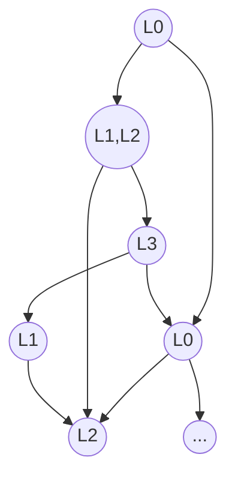

---
# try also 'default' to start simple
theme: seriph
# random image from a curated Unsplash collection by Anthony
# like them? see https://unsplash.com/collections/94734566/slidev
# coverBackgroundUrl: https://source.unsplash.com/collection/94734566/1920x1080
# apply any windi css classes to the current slide
class: 'text-left'
# https://sli.dev/custom/highlighters.html
highlighter: shiki
# show line numbers in code blocks
lineNumbers: true
# some information about the slides, markdown enabled
info: |
  ## Slidev Starter Template
  Presentation slides for developers.

  Learn more at [Sli.dev](https://sli.dev)
# persist drawings in exports and build
drawings:
  persist: false
# page transition
transition: fade
# use UnoCSS
css: unocss
hideInToc: true
layout: cover
fonts:
  # basically the text
  sans: 'Poppins'
  # use with `font-serif` css class from windicss
  serif: 'Lora'
  # for code blocks, inline code, etc.
  mono: 'Fira Code'
---

# Model Checking 2nd Edition
## Chapter 5: CTL Model Checking

 Wang Qirui 1W202047 
 
{{new Date().toLocaleDateString()}}

<!--
The last comment block of each slide will be treated as slide notes. It will be visible and editable in Presenter Mode along with the slide. [Read more in the docs](https://sli.dev/guide/syntax.html#notes)
-->

---
hideInToc: true
---
# Table of Contents

<Toc/>

---
title: Introduction to CTL Model Checking
---

# Introduction

What is CTL model checking?

<v-click>

Is $M=(AP,S,R,S_0,L)$ a *model* of CTL formula $f$ (i.e., $M\models f$)?

</v-click>

<v-click>

Find the set $\llbracket f \rrbracket_M$ of all states in $M$ that satisfy $f$:

$$
\llbracket f \rrbracket_M \models \{s\in S\;\vert\; M, s\models f\}
$$

</v-click>

<v-clicks depth="2">

- Problem can be solved by checking $S_0 \subseteq \llbracket f \rrbracket$.
  - $S_0$ is not needed during model checking.
- We fix $AP$ for the rest of the chapter.
  - $AP$ is not needed too.

</v-clicks>

<v-click>

Represented as a directed graph $(S,R)$ with labeling $L$.

</v-click>

---
class: 'text-left'
layout: intro
level: 1
---

## Explicit-State CTL Model Checking

---
hideInToc: true
---

# Explicit-State CTL Model Checking

Introduction

### How to determine which states in $S$ satisfy $f$?

<v-click>

Labeling each state $s$ with $label(s)$, which is a set of subformulas that are true in $s$.

</v-click>

<v-clicks depth= "2">

1. Let $label(s)$ be $L(S)$.
2. Then a sub-routine with multiple stages
   1. During the $i$-th stage, subformulas with $i-1$ nested CTL operators are processed.
   2. Subformula that is processed is added to the labeling of each state that in which it is true.
3. Terminated with $M,s\models f \iff f\in label(s)$.

</v-clicks>

---
hideInToc: true
level: 2
---
# Explicit-State CTL Model Checking

Introduction

As mentioned in 4.3.1, any CTL formula can be expressed in terms of

$$
\lnot, \lor, \mathbf{EX}, \mathbf{EU}, \mathbf{EG}.
$$

The intermediate stages of the algorithm is able to handle *6* cases:

- $g$ is atomic
- $g$ has one of the forms: $\lnot f_1$, $f_1\lor f_2$, $\mathbf{EX}f_1$, $\mathbf{E}(f_1\mathbf{U}f_2)$, $\mathbf{EG}f_1$.

For example:

- $\lnot f_1$: states that are not labeled by $f_1$.
- $f_1\lor f_2$: states that is labeled by $f_1$ or $f_2$.
- $\mathbf{EX}f_1$: label states that has some successor labeled by $f_1$.

---
title: Examples
level: 2
layout: two-cols
---

# Example
Handling formula of form $g=\mathbf{E}(f_1\mathbf{U}f_2)$

<v-clicks at="0">

1. Find all states that are labeled with $f_2$.
2. Work backward using converse of $R$ to find all states that can be reached by a path in which each state is labeled with $f_1$.
3. All such states are labeled with $g$.

</v-clicks>

::right::

Figure 5.1
 
Procedure for labeling the states satisfying $g=\mathbf{E}(f_1\mathbf{U}f_2)$

---
level: 2
---

# Another Example
The case of $g=\mathbf{EG}f_1$

Based on the decomposition of the graph into *nontrivial strongly connected components*.

> 1. **Strongly connected component (SCC)** is a subgraph such that every node is reachable from every other node along a directed path.
> 2. **Maximal SCC (MSCC)** is a SCC that is not a subset of any other SCC.
> 3. **Nontrivial SCC** is a SCC with more than one node or with only one node with a self-loop.

1. Let's retain only states that satisfy $f_1$:
$$
\begin{aligned}
M^\prime &= (S^\prime, R^\prime, L^\prime) \\
S^\prime &= \{s\in S\;\vert\; M,s\models f_1\} \\
R^\prime &\models R\vert_{S^\prime\times S^\prime} \\
L^\prime &\models L\vert_{S^\prime}
\end{aligned}
$$
**Note**: $R^\prime$ may not be left-total in this case.

---
hideInToc: true
---
# Another Example
The case of $g=\mathbf{EG}f_1$

<ColorBox title="Lemma 5.1">

$M,\;s\models \mathbf{EG}f_1$ if and only if the following conditions are satisfied:

1. $s\in S^\prime$.
2. There exists a path in $M^\prime$ that leads from $s$ to some node $t$ in a nontrivial MSCC $C$ of the graph $(S^\prime,R^\prime)$.

</ColorBox>

Proof.

<v-click >

- **Sufficiency**

</v-click>

<v-click >

It's clearly that:
$$
M,\;s\models \mathbf{EG}f_1 \implies s\in S^\prime. \\
$$

</v-click>

---
hideInToc: true
---
# Another Example
Proof to Lemma 5.1

Let $\pi$ be an infinite path in $M$ starting at $s$, then:

$$
M,\;\pi\models \mathbf{G}f_1 \implies \pi\in S^\prime. \\
$$

Since $M$ is finite, it's possible to write $\pi$ as $\pi=\pi_0\pi_1$, where $\pi_0$ is a finite initial segment and $\pi_1$ is an infinite suffix of $\pi$. Then we will show that $C$ is a nontrivial SCC.

Let $C$ be the set of all states in $\pi_1$. and take states $s_1,s_2\in C$, since $\pi_1$ is an infinite path, then the segment from $s_1$ to $s_2$ is a finite path from $s_1$ to $s_2$ within $C$. So $C$ is a nontrivial SCC.

Figure

**Note**: if $C$ is not maximal, then it's contained in an MSCC $C^\prime$ and $\pi_0$ leads to $C^\prime$ since it leads to $C$.

---
hideInToc: true
---
# Another Example
Proof to Lemma 5.1

- **Necessity**

<v-click>

Let $\pi_0$ be the path from $s$ to $t$ in $M^\prime$ and $\pi_1$ be the path of length at least 1 from $t$ back to $t$.

- Since $t$ is in a nontrivial MSCC, then $\pi_1$'s existence is guaranteed.
- All the states on the infinite path $\pi=\pi_0\pi^\omega_1$ satisfy $f_1$.

Since $\pi$ is a path from $s$ in $M$, then $M,\;s\models \mathbf{EG}f_1$.

</v-click>

<Link class="font-serif" to="9">Lemma 5.1</Link> shows that the search of infinite paths can be reduced to the search of an MSCC.

- The search of SCCs is exponential. (they might include all subsets of $S$)
- The search of MSCCs can be done in linear time.

---
hideInToc: true
layout: two-cols
---
# Another Example
The case of $g=\mathbf{EG}f_1$

Then the algorithm for the case of $g=\mathbf{EG}f_1$, with the help of Lemma 5.1, turns out to be:

<v-clicks>

1. Construct the Kripke structure $M^\prime=(S^\prime,R^\prime,L^\prime)$.
2. Partition the graph $(S^\prime,R^\prime)$ into its MSCCs using Tarjan's algorithm1.
3. Find those states belonging to nontrivial ones.
4. Work backward using the converse of $R^\prime$ like the case of $\mathbf{E}(f_1\mathbf{U}f_2)$.

</v-clicks>

<v-click>

1 Tarjan's algorithm (will be introduced in 5.5) finds the set of all MSCCs with time complexity $O(|S^\prime|+|R^\prime|)$.

</v-click>

::right::

Figure 5.2
 
Procedure for labeling the states satisfying $g=\mathbf{EG}f_1$

---
title: General Approach
level: 2
---
# Explicit-State CTL Model Checking

General approach

#### How to handle arbitrary CTL formula $f$?

- Decompose the formula into subformulas and apply the state-labeling algorithm to them.
- Start with the **shortest** and **most deeply nested** subformulas, and **work outward**.
  - All subformulas of formula currently processing are guaranteed to be processed.

Since each pass takes time $O(|S|+|R|)$ and $f$ has at most $|f|$ different subformulas,
the total pass requires time:

$$
O(|S|+|R|) \cdot |f| = O(|f|\cdot(|S|+|R|)).
$$

---
hideInToc: true
---
# Explicit-State CTL Model Checking
General approach

<v-click>

<ColorBox title="Theorem 5.2" accentColor="teal">

There is an algorithm for determining $\llbracket f \rrbracket$ that runs in time $O(|f|\cdot(|S|+|R|))$.

</ColorBox>

</v-click>

- Theorem 5.2 holds for every CTL formula over $\mathbf{EX}$, $\mathbf{E(U)}$, and $\mathbf{EG}$.
  - Every other CTL formula can be expressed by means of these three operators. (Chapter 4)
  - Preprocess the CTL formula to obtain a formula containing only $\mathbf{EX}$, $\mathbf{E(U)}$, and $\mathbf{EG}$.
    - All translations are linear in the size of the original formula, except for $\mathbf{A}(\mathbf{U})$.

Recall that:

$$
\mathbf{A}(f\mathbf{U}g) = \neg\mathbf{E}(\neg g\mathbf{U}(\neg f\land\neg g))\land\mathbf{EG}\neg g.
$$

There are only 8 different subformulas, so the overall time complexity is preserved.

---
level: 2
---
# Example of model-checking algorithm for CTL

Microwave oven

---
class: 'text-left'
layout: intro
level: 1
---

# Model-Checking CTL with Fairness Constraints

---
hideInToc: true
---

# Model-Checking CTL with Fairness Constraints

<v-click>

<ColorBox title="Lemma 5.3">

$M,\;s\models_F\mathbf{E}_f\mathbf{G}f_1$ if and only if the following conditions are satisfied:

1. $s\in S^\prime$.
2. There exists a path in $S^\prime$ that leads from $s$ to some node $t$ in a nontrivial maximal strongly connected component of $C$ of the graph $(S^\prime,R^\prime)$.

</ColorBox>

</v-click>

---
hideInToc: true
---
# Model-Checking CTL with Fairness Constraints

<v-click>

<ColorBox title="Theorem 5.4" accentColor="teal">

There is an algorithm for determining whether a CTL formula $f$ is true with respect to the fair semantics in a state $s$ of the structure $M=(S,R,L,F)$ that runs in time $O(|f|\cdot(|S|+|R|)\cdot|F|)$.

</ColorBox>

</v-click>

---
class: 'text-left'
layout: intro
level: 1
---
# CTL Model Checking via Fixpoint Computation

---
level: 2
title: Background on Fixpoint Theory
---

## Background on Fixpoint Theory

A set $S^\prime\subseteq S$ is a **fixpoint** of a function $\tau: \mathcal{P}(S)\to\mathcal{P}(S)$ if $\tau(S^\prime)=S^\prime$.

---
hideInToc: true
---
<v-click>

<ColorBox title="Theorem 5.5" accentColor="teal">

Let $\tau$ be a predicate transformer on $\mathcal{P}(S)$. Then if $\tau$ is monotonic it has a greatest fixpoint, $\nu Z.\tau(Z)$, and a least fixpoint, $\mu Z.\tau(Z)$, defined as follows:

- $\nu Z.\tau(Z) = \bigcup\{Z\;\vert\;Z \subseteq \tau(Z)\}$.
- $\mu Z.\tau(Z) = \bigcap\{Z\;\vert\;Z \supseteq \tau(Z)\}$.

Furhtermore, if $\tau$ is $\bigcap$-continuous, then $\nu Z.\tau(Z)=\bigcap\tau^{i}(true)$, and if $\tau$ is $\bigcup$-continuous, then $\mu Z.\tau(Z)=\bigcup\tau^{i}(false)$.

</ColorBox>

</v-click>

---
hideInToc: true
---
<v-click>

<ColorBox title="Lemma 5.6">

if $S$ is finite and $\tau$ is monotonic, then $\tau$ is also $\bigcap$-continuous and $\bigcup$-continuous.

</ColorBox>

</v-click>

---
hideInToc: true
---
<v-click>

<ColorBox title="Lemma 5.7">

if $\tau$ is monotonic, then for every $i$, $\tau^{i}(false)\subseteq\tau^{i+1}(false)$ and $\tau^{i}(true)\supseteq\tau^{i+1}(true)$.

</ColorBox>

</v-click>

---
hideInToc: true
---
<v-click>

<ColorBox title="Lemma 5.8">

if $\tau$ is monotonic and $S$ is finite, the there is an integer $i_0$ such that for every $j\ge i_0, \tau^j(false)=\tau^{i_0}(false)$. Similarly, there is some $j_0$ such that for every $j\ge j_0, \tau^j(true)=\tau^{j_0}(true)$.

</ColorBox>

 

<ColorBox title="Lemma 5.9">

if $\tau$ is monotonic and $S$ is finite, then there is an integer $i_0$ such that $\mu Z.\tau(Z)=\tau^{i_0}(false)$. Similarly, there is an integer $j_0$ such that $\nu Z.\tau(Z)=\tau^{j_0}(true)$.

</ColorBox>

</v-click>

---
layout: end
---