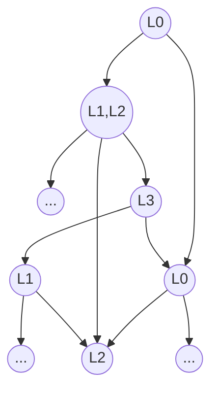

---
# try also 'default' to start simple
theme: seriph
# random image from a curated Unsplash collection by Anthony
coverBackgroundUrl: https://source.unsplash.com/collection/iP4PayCz_VA/1920x1080
# apply any windi css classes to the current slide
class: 'text-left'
# https://sli.dev/custom/highlighters.html
highlighter: shiki
# show line numbers in code blocks
lineNumbers: false
# some information about the slides, markdown enabled
info: |
  ## Model Checking 2nd Edition
  ### Chapter 5: CTL Model Checking
# persist drawings in exports and build
drawings:
  persist: false
# page transition
transition: fade
# use UnoCSS
css: unocss
hideInToc: true
layout: cover
fonts:
  # basically the text
  sans: 'Poppins'
  # use with `font-serif` css class from windicss
  serif: 'Lora'
  # for code blocks, inline code, etc.
  mono: 'JetBrains Mono'
---

# Model Checking 2nd Edition
## Chapter 5: CTL Model Checking

---
hideInToc: true
layout: intro
---

# CTL Model Checking
The model-checking problem and algorithms for CTL

Wang Qirui 1W202047
 
{{new Date().toLocaleDateString()}}

---
hideInToc: true
---
# Table of Contents

<Toc maxDepth = "2" columns = "2" mode = "all"/>

---
title: Introduction to CTL Model Checking
---

# Introduction

What is CTL model checking?

<v-click>

Is $M=(AP,S,R,S_0,L)$ a *model* of CTL formula $f$ (i.e., $M\models f$)?

</v-click>

<v-click>

Find the set $\llbracket f \rrbracket_M$ of all states in $M$ that satisfy $f$:

$$
\llbracket f \rrbracket_M \models \{s\in S\;\vert\; M, s\models f\}
$$

</v-click>

<v-clicks depth="2">

- Problem can be solved by checking $S_0 \subseteq \llbracket f \rrbracket$.
  - $S_0$ is not needed during model checking.
- We fix $AP$ for the rest of the chapter.
  - $AP$ is not needed too.

</v-clicks>

<v-click>

Represented as a directed graph $(S,R)$ with labeling $L$.

</v-click>

---
src: ./pages/5-1.md
---

---
src: ./pages/5-2.md
---

---
src: ./pages/5-3.md
---

---
src: ./pages/problem.md
---