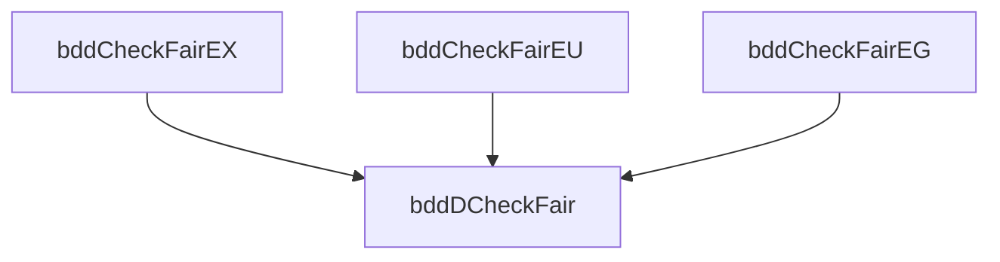

# Fairness in Symbolic Model Checking
## Extend to include fairness constraints

---
level: 2
hideInToc: true
---

# Fairness in Symbolic Model Checking
Introduction

Assume the fairness constraints are given by a set of CTL formulas:

$$
    F = \{ P_1, P_2, \ldots, P_n \}
$$

Then we define a series procedures for checking CTL formulas relative to the fairness constraints in $F$, similar to the procedures with prefix "Check".

Recall that:

$$
    \mathbf{EG}f = \bm{\nu Z}.f\land\bigwedge_{k=1}^n\mathbf{EXE}(f\mathbf{U}(Z\land P_k)).
$$

---
level: 2
hideInToc: true
---

# Fairness in Symbolic Model Checking
Procedure definitions

Based on that, we can compute the set of states like:

$$
\begin{aligned}
    \mathit{bddCheckFairEG}(f(\bar{v})) &= \\
    \bm{\nu Z}(\bar{v}).f(\bar{v})\land
    \bigwedge_{k=1}^n
    &\mathit{bddCheckEX}(
        \mathit{bddCheckEU}(
            f(\bar{v}), \bm{Z}(\bar{v})\land \mathit{Check}(P_k)
        )).
\end{aligned}
$$

The fixpoint can be evaluated as before, *except* that **each time** the above expression is *evaluated*, some **nested** fixpoint computations are performed(inside $\mathit{bddCheckEU}$).

Checks for $\mathbf{EX}f$ and $\mathbf{E}(f\mathbf{U}g)$ are similar to explicit state model checking.
The set of states that are the start of some fair computation is:

$$
    \mathit{fair}(\bar{v}) = \mathit{bddDCheckFair}(\mathbf{EG}\mathit{true}).
$$

---
level: 2
title: Example for $\mathbf{EX}f$ and $\mathbf{E}(f\mathbf{U}g)$
---

# Fairness in Symbolic Model Checking
$\mathbf{EX}f$ and $\mathbf{E}(f\mathbf{U}g)$

$\mathbf{EX}f$ is true under fairness constraints in a state $s$ if and only if:

1. there is successor state $s'$.
2. $s'$ is at the beginning of some fair computation path.

And it is equivalent to $\mathbf{EX}(f\land\mathit{fair})$ (withou fairness constraints). Then we define:

$$
    \mathit{bddCheckFairEX}(f(\bar{v})) = \mathit{bddCheckEX}(f(\bar{v})\land\mathit{fair}(\bar{v})).
$$

Similarly, $\mathbf{E}(f\mathbf{U}g)$ is equivalent to $\mathbf{E}(f\mathbf{U}(g\land\mathit{fair}))$. Then we define:

$$
    \mathit{bddCheckFairEU}(f(\bar{v}), g(\bar{v})) = \mathit{bddCheckEU}(f(\bar{v}), g(\bar{v})\land\mathit{fair}(\bar{v})).
$$