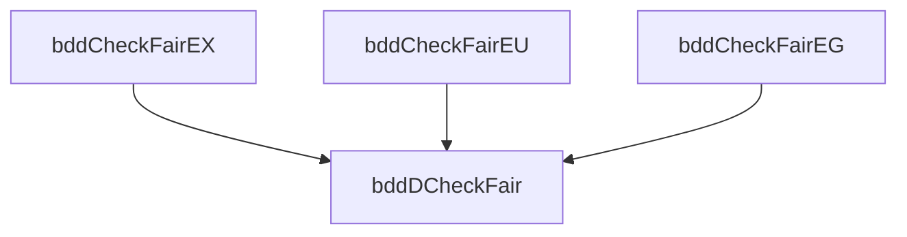

# Fairness in Symbolic Model Checking
## Extend to include fairness constraints

---
level: 2
hideInToc: true
---

# Fairness in Symbolic Model Checking
Introduction

Given fairness constraints as a set of CTL formulas:

$$
    F = \{ P_1, P_2, \ldots, P_n \}
$$

<v-click>

A series of procedures for checking CTL formulas relative to the $P_i$s, similar to the procedures with prefix "Check".

</v-click>

---
level: 2
hideInToc: true
---

# Fairness in Symbolic Model Checking
Procedure definitions

Recall that:

$$
    \mathbf{EG}f = \bm{\nu Z}.f\land\bigwedge_{k=1}^n\mathbf{EXE}(f\mathbf{U}(Z\land P_k)).
$$

<v-click>

Based on that, we can compute the set of states:

$$
\begin{aligned}
    \mathit{bddCheckFairEG}(f(\bar{v})) &= \\
    \bm{\nu Z}(\bar{v}).f(\bar{v})\land
    \bigwedge_{k=1}^n
    &\mathit{bddCheckEX}(
        \mathit{bddCheckEU}(
            f(\bar{v}), \bm{Z}(\bar{v})\land \mathit{Check}(P_k)
        )).
\end{aligned}
$$

**Each time** the above expression is **evaluated**, some fixpoint computations inside $\mathit{bddCheckEU}$ are performed.

</v-click>

---
level: 2
title: Example for $\mathbf{EX}f$ and $\mathbf{E}(f\mathbf{U}g)$
---

# Fairness in Symbolic Model Checking
$\mathbf{EX}f$ and $\mathbf{E}(f\mathbf{U}g)$

Checks for $\mathbf{EX}f$ and $\mathbf{E}(f\mathbf{U}g)$ are similar to explicit state model checking.
The set of states that are the start of some fair computation is:

$$
    \mathit{fair}(\bar{v}) = \mathit{bddDCheckFair}(\mathbf{EG}\mathit{true}).
$$

<v-click>

$\mathbf{EX}f$ is true under fairness constraints in a state $s$ if and only if:

</v-click>

<v-clicks>

1. there is successor state $s'$.
2. $s'$ is at the beginning of some fair computation path.

</v-clicks>

<v-click>

$\mathbf{EX}f$ is equivalent to $\mathbf{EX}(f\land\mathit{fair})$ (without fairness constraints). Then define

$$
    \mathit{bddCheckFairEX}(f(\bar{v})) = \mathit{bddCheckEX}(f(\bar{v})\land\mathit{fair}(\bar{v})).
$$

</v-click>

<v-click>

Also, $\mathbf{E}(f\mathbf{U}g)$ is equivalent to $\mathbf{E}(f\mathbf{U}(g\land\mathit{fair}))$. So

$$
    \mathit{bddCheckFairEU}(f(\bar{v}), g(\bar{v})) = \mathit{bddCheckEU}(f(\bar{v}), g(\bar{v})\land\mathit{fair}(\bar{v})).
$$

</v-click>